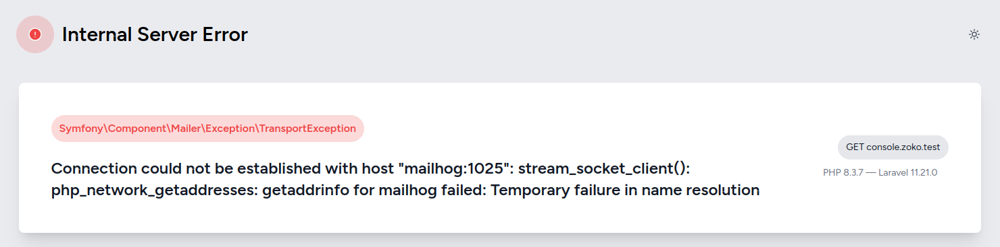

# Laravel Troubleshooting Guide

Welcome to the Laravel Troubleshooting Guide! This repository is a collection of common issues, bugs, and errors you may encounter while working with Laravel, along with their solutions and workarounds. Whether you're facing database connection problems, issues with migrations, or debugging route errors, this guide aims to provide quick and effective solutions to keep your Laravel projects running smoothly.

Feel free to contribute by adding any other issues and solutions you've encountered to help the community!

## Mail

### Setting up Mailhog: Connection could not be established with host "mailhog:1025": stream_socket_client(): php_network_getaddresses: getaddrinfo for mailhog failed: Temporary failure in name resolution

**Error preview**



### Try

Check your `docker-compose.yml` file.

```yaml
mailhog:
    image: 'mailhog/mailhog:latest'

    restart: always
    ports:
        - '${FORWARD_MAILHOG_PORT:-1025}:1025'
        - '${FORWARD_MAILHOG_DASHBOARD_PORT:-8025}:8025'
    networks:
        - sail
```

Check your `.env` file
```dotenv
MAIL_MAILER=smtp
MAIL_HOST=mailhog
MAIL_PORT=1025
MAIL_USERNAME=null
MAIL_PASSWORD=null
MAIL_ENCRYPTION=null
MAIL_FROM_ADDRESS="admin@example.com"
MAIL_FROM_NAME="${APP_NAME}"
```